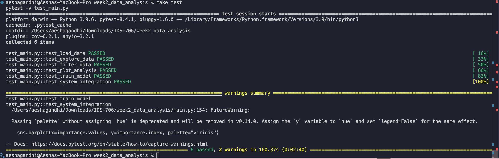
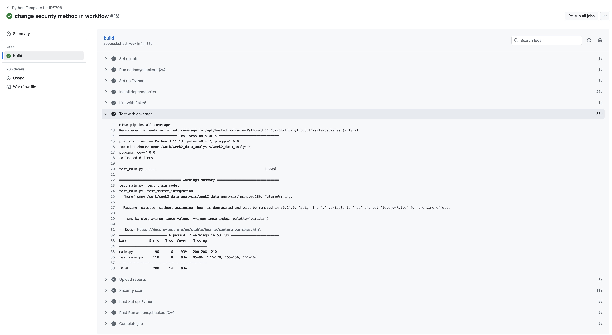
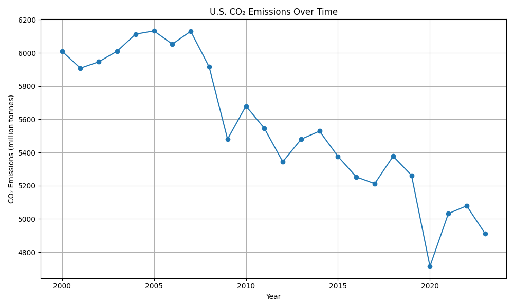
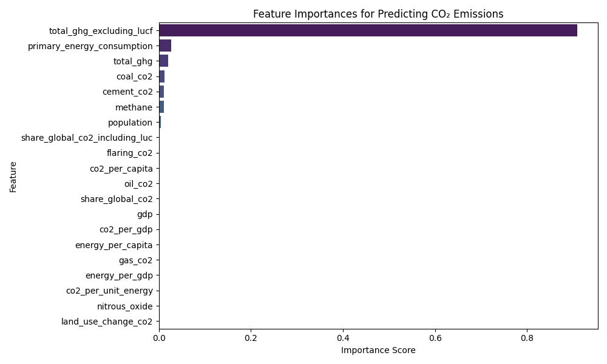
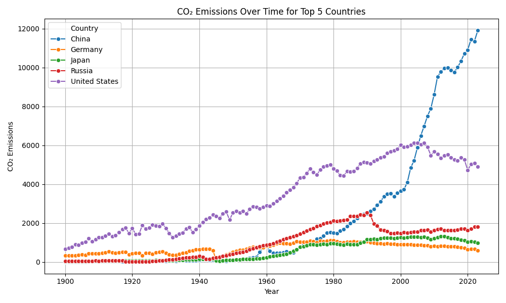
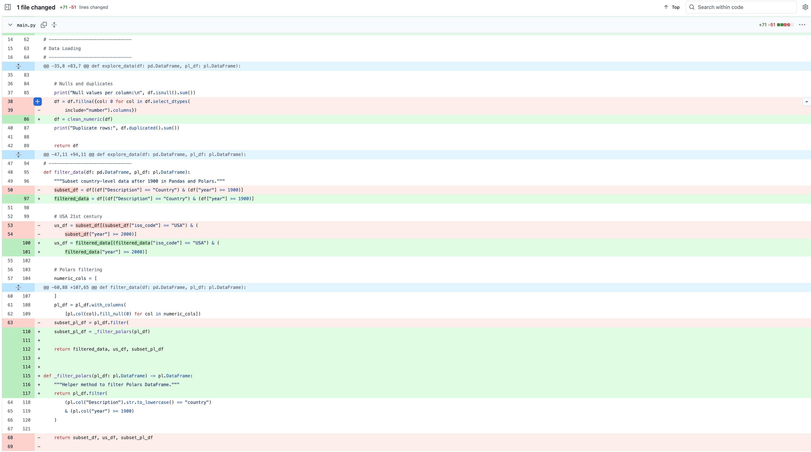
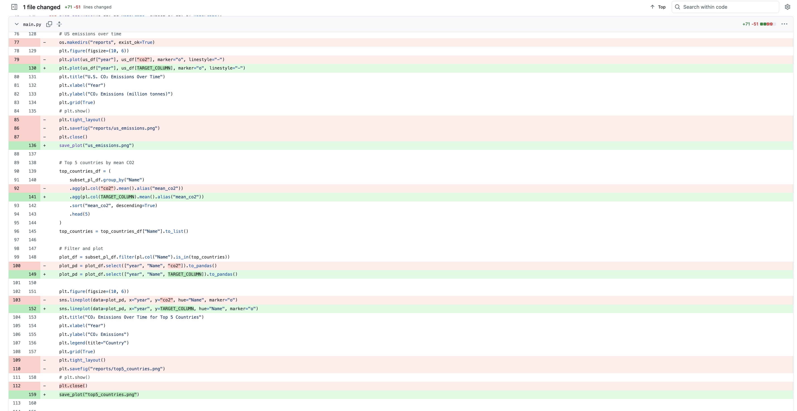
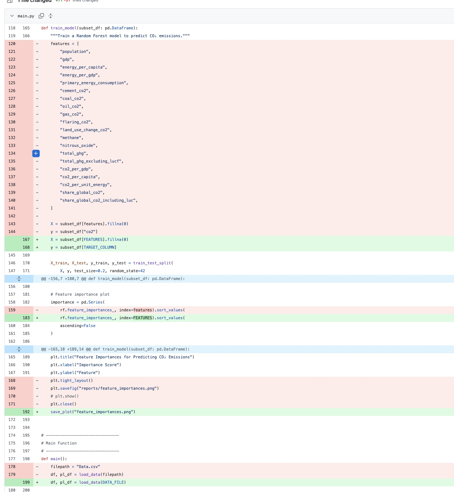

# Week 2: Mini Assignment

[](https://github.com/aeshagandhi/week2_data_analysis/actions/workflows/main.yml)


## Project Structure

The repository is organized as follows:

```
week2_data_analysis/
├── .devcontainer/
│   └── devcontainer.json         # VS Code Dev Container configuration
├── .github/
│   └── workflows/
│       └── main.yml              # GitHub Actions CI workflow
├── Data.csv                      # Kaggle dataset 
├── Dockerfile                    # Docker image build instructions
├── Makefile                      # Automation for install, lint, format, test, Docker, etc.
├── README.md                     # Project documentation
├── requirements.txt              # Python dependencies
├── main.py                       # Main analysis and modeling script
├── main.ipynb                    # Original Jupyter notebook (optional)
├── test_main.py                  # Unit and system tests
```

**Key files:**
- `main.py`: All core data analysis, filtering, plotting, and ML code.
- `main.ipynb`: All output of data analysis.
- `test_main.py`: Unit and system tests for all major functions.
- `requirements.txt`: All Python dependencies.
- `Makefile`: Automates common tasks and Docker commands.
- `Dockerfile`: Defines the container environment.
- `.devcontainer/devcontainer.json`: VS Code Dev Container setup.
- `.github/workflows/main.yml`: Continuous integration workflow.
- `README.md`: Project overview, setup, and instructions.

This structure ensures reproducibility, testability, and ease of development.

## Development Environment Setup

This project supports reproducible environments using **Docker** and **VS Code Dev Containers**.

### Prerequisites
- [Docker](https://docs.docker.com/get-docker/) installed
- [Visual Studio Code](https://code.visualstudio.com/) with the [Dev Containers extension](https://marketplace.visualstudio.com/items?itemName=ms-vscode-remote.remote-containers)

### Docker Setup

1. **Build the Docker image:**
   ```sh
   make build
   ```
2. **Run the Docker container:**
   ```sh
   make run
   ```
   This will start the container and map port 5004 to 5000.

3. **Run tests inside the container:**
   ```sh
   make test
   ```

4. **Clean up Docker images:**
   ```sh
   make clean
   ```

### Dev Container Setup (VS Code)

1. Open the project folder in VS Code.
2. If prompted, click "Reopen in Container" or use the Command Palette (`Cmd+Shift+P`) and select **Dev Containers: Reopen in Container**.
3. The container will build using the provided `Dockerfile` and install all dependencies from `requirements.txt`.
4. You can now run, test, and develop in a consistent environment.

### Testing

- **Run all tests:**
  ```sh
  make test
  ```
- **Test coverage:**  
  All core functions (data loading, filtering, grouping, preprocessing, ML model) are covered by unit and system tests in `test_main.py`.

## Test Results



### Automation

- **Format code:**  
  ```sh
  make format
  ```
- **Lint code:**  
  ```sh
  make lint
  ```
- **Install dependencies:**  
  ```sh
  make install
  ```

## Dockerfile Overview

This project includes a `Dockerfile` to ensure a reproducible and isolated environment for running your data analysis code.

**Key steps in the Dockerfile:**
- **Base Image:** Uses `python:3.10-slim` for a lightweight Python environment.
- **Working Directory:** Sets `/app` as the working directory inside the container.
- **Dependency Installation:**  
  - Copies `requirements.txt` into the container.
  - Installs all Python dependencies listed in `requirements.txt` using pip.
- **Copy Project Files:** Copies all project files into the container.
- **Default Command:** Runs `main.py` when the container starts.

**How to use:**
1. **Build the Docker image:**
   ```sh
   docker build -t mini_data_analysis .
   ```
2. **Run the Docker container:**
   ```sh
   docker run -it mini_data_analysis
   ```


## Continuous Integration with GitHub Actions

This project uses a GitHub Actions workflow for automated continuous integration (CI).  
The workflow is defined in `.github/workflows/main.yml` and runs automatically on every push and pull request.

**What the workflow does:**
- Checks out the repository code.
- Sets up Python 3.11 on an Ubuntu runner.
- Installs all dependencies from `requirements.txt`.
- Runs linting on `main.py` using `flake8` to ensure code quality and style.
The following enhancements were made into the CI workflow for the latest week 5 assignment (see commit diff below):
- Tracking for test coverage to measure how much of the project's code gets executed during test runs.
- Archive generated visualizations and plots as archives in Github for public visibility.
- Security scan step to check each dependency being installed from requirements.txt for known vulnerabilites. This checks if any versions could have security issues, which is important for reproducability and security, as well as compliance.



This process helps keep the codebase clean and maintainable by catching linting errors early and ensuring all dependencies are installed for every build.

---

**Environment Summary:**  
- Use Docker or Dev Container for reproducible environments.
- All dependencies are in `requirements.txt`.
- Common tasks are automated via the Makefile.
- Run tests with `make test` to validate your code.


## Data Analysis Using Pandas/Polars on a Kaggle Dataset

All exploratory data analysis code is contained in the `main.py` file. The original code was done in `main.ipynb` for interactive exploration, and then converted into `main.py` for the Python script submission.

### About the Data

The dataset is called **CO₂ Emissions Across Countries, Regions, & Sectors**, which includes detailed historical information on population, GDP, energy use, and emissions from cement, coal, oil, gas, flaring, and land-use change. The data is sourced from Our World in Data, but obtained from Kaggle.  
The dataset can be publicly found through Kaggle:  
https://www.kaggle.com/datasets/shreyanshdangi/co-emissions-across-countries-regions-and-sectors.

### Project Overview

This project explores global carbon dioxide and greenhouse gas emissions data, focusing on patterns across countries and years. Both Pandas and Polars were used for performance comparison and basic data cleaning/visualization.  
A Random Forest Regressor from Scikit-learn was used to recognize patterns in beneficial features for predicting carbon dioxide emissions.
Question: What factors influence the global carbon dioxide emissions the most and use these to build a predictive model? 

### Analysis Steps

1. **Importing the Dataset:**  
   Load the Kaggle dataset and inspect the data via `.head()`, `.info()`, and `.describe()`. The dataset is 13.77 MB and contains 43,746 rows and 80 columns. Filtering was done later to create a subset of the data.

2. **Data Cleaning:**  
   Check for missing values and duplicates, and fill NaN values in numeric columns with zeros.

3. **Filtering and Grouping:**  
   Filter the dataset to only consider countries (not territories or other regions) and years after 1900. Group by year to examine trends in carbon dioxide emissions over time, and by country/year to consider mean GDP, population, and mean CO₂. For example, I explored the United States carbon dioxide emissions over time since 2000, because I was interested in seeing how the U.S has been working to lower their emissions in recent years and whether their missions to do so have been successful. From the plot below, there is an overall decrease in carbon dioxide emissions, but it is interesting to notice the ups and downs within recent years. Like from 2017 to 2020, the carbon emissions were decreasing but then after 2020, began to increase again, which would be interesting to question in its relationship with the COVID-19 pandemic.
   

4. **Random Forest Machine Learning Model:**  
   Train a Random Forest Regressor with 100 trees and split into 80/20 training-testing sets, with the target variable as total CO₂ emissions. Evaluate the model using Mean Squared Error and R² score.  
   Two models were created: the first with a few features ("population", "gdp", "cement_co2", "co2_per_capita"), and the second with many more features. The second model decreased the mean square error from 370 to 78.

5. **Plotting:**  
   Feature Importance plot was used to interpret the results of the random forest and identify the strongest predictors of CO₂ emissions, which included greenhouse gas totals and primary energy consumption.
   


6. **Polars Exploration:**  
   Use Polars to explore the data and visualize trends among the top 5 countries by mean CO₂ emissions since 1900. The stacked line plot shows that China has had a rapid increase in emissions since 1990, while the U.S. has been slowly decreasing emissions in the last 20 years. Germany, Japan, and Russia have similar trends, while the U.S. and China stand out. This is a helpful discovery for understanding which countries contribute to higher carbon emissions and how their current plans are affecting emissions over time. For example, the U.S general public has become more conscious of global issues such as global warming, climate change, and energy consumption, and many organizations proactively aim to reduce their emissions especially recently.  
   

### Conclusion

Energy consumption and total greenhouse gas emissions are strong predictors of CO₂ emissions, which seems reasonable as carbon dioxide and fossil fuels use are often connected. Some features such as population and GDP aren't as important as expected when considering emissions, possibly due to a less direct relationship. This was a surprising discovery as intutively we would expect larger population countries to naturally be larger energy emmitters.   
The second random forest, which was much for feature rich, achieved a reasonable R² score, suggesting the model could be capturing the relationship between emissions and energy use decently well. More analysis could be done at a more specific granularity, such as at the country level, since the model could be biased by large emitters like China, India, and the U.S. Modeling at the country level could show clearer patterns in. specific features and account for regional differences as well.
A line plot of U.S. carbon dioxide emissions from 2000 to 2024 shows a general decrease, possibly explained by a shift toward alternative energy sources. This project provides insights into forecasting emissions and evaluating the impact of national and global energy policies. Possibly in combination with political data on proposals and bills in the energy sector, more predictive modeling and machine learning models could be produced.

### Codebase Refactoring/Changes
Minor code changes were made which do not affect the overall functionality of the code but improve readability and efficiency in main.py. These include:
- extracting the constants for paths, column names, and features at the top to remove redundant use
- extract common plotting setups and saving plots into separate functions
- extract data cleaning into a helper function to reduce repetitive operations such as filling na valus
- split the train_model function into smaller sub functions for easier understandablity
See the commit diffs below for all refactoring/code improvements:






